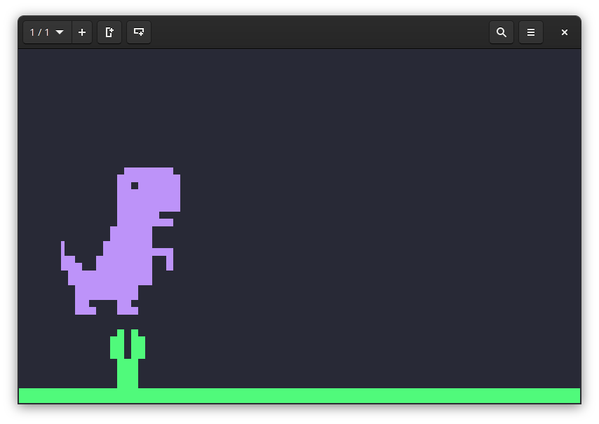

# Dino-CLI

[](https://aur.archlinux.org/packages/dino-cli/)

---

A dinosaur on the CLI.

Based on [Termosaur](https://github.com/b37t1td/termosaur), but written in D.
This is only an animation, and not interactive like Termosaur.

## Screenshot

> Click image to view Asciinema recording.

[](https://asciinema.org/a/oLH81fRGnb6EYVe07OmbJ4SqA)

## Building

```
git clone https://github.com/tryton-vanmeer/dino-cli
cd dino-cli
dub build -b release
```
